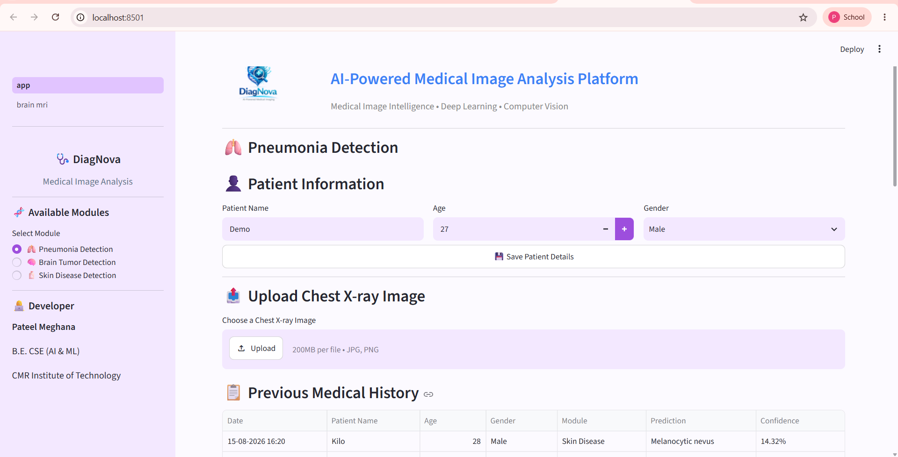
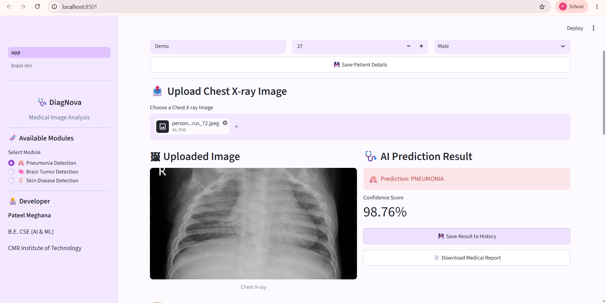
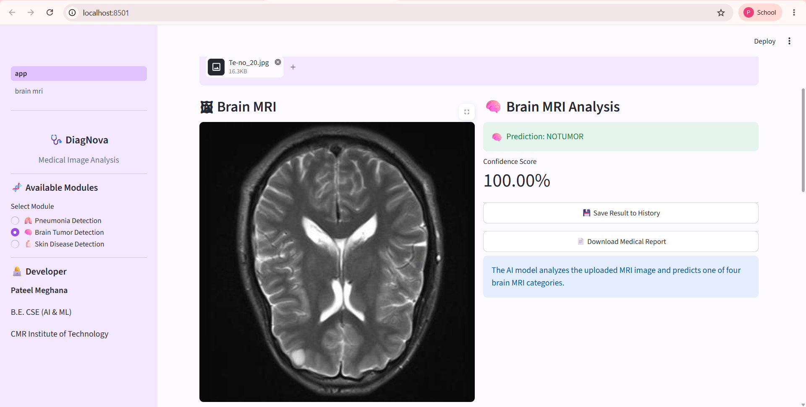

<div align="center">

# 🩺 DiagNova

### AI-Powered Multi-Specialty Medical Image Analysis Platform

**A modular deep learning platform for medical image classification, built with PyTorch and Streamlit.**

DiagNova analyzes medical images across multiple specialties using custom CNN models, providing
**image preprocessing, model inference, confidence scores, prediction history, and automated PDF reports.**

</div>

---

## 🎯 Key Achievements

✅ Built an end-to-end medical image analysis platform using PyTorch and Streamlit

✅ Achieved **93.56% Test Accuracy** on Brain MRI Tumor Classification

✅ Achieved **85.26% Test Accuracy** on Chest X-ray Pneumonia Detection

✅ Implemented confidence scoring and prediction history tracking

✅ Integrated PDF report generation for prediction results

✅ Evaluated both Custom CNN and ResNet18 Transfer Learning approaches

---

## 📌 Overview

DiagNova is a modular AI-powered medical image classification platform designed for disease detection from medical imaging data.

The platform combines:

- Medical Image Preprocessing
- Deep Learning-based CNN Models
- Model Evaluation Pipelines
- Real-Time Prediction Interface
- Confidence Score Visualization
- Prediction History Management
- PDF Report Generation

### Supported Medical Imaging Modules

| Module | Classification Task |
|----------|----------|
| 🫁 Chest X-ray | Pneumonia Detection |
| 🧠 Brain MRI | Brain Tumor Classification |
| 🩺 Skin Disease | Skin Disease Classification |

> ⚠️ **Disclaimer:** This project is developed for educational and research purposes only. Predictions generated by this platform should not be used for clinical diagnosis or treatment decisions.

---

## ✨ Features

- 🩻 Medical Image Classification
- 🤖 PyTorch CNN Models
- 📊 Performance Evaluation Metrics
- 📈 Confidence Score Visualization
- 📋 Prediction History Tracking
- 📄 Automated PDF Report Generation
- 🌐 Interactive Streamlit Web Application
- 🧪 Transfer Learning Experiments
- 🔬 Medical Image Preprocessing Pipelines
- 💾 Git LFS Model Management

---

## 🏗️ System Architecture

```text
                        DiagNova
                           │
                           ▼
                  Streamlit Interface
                           │
         ┌─────────────────┼─────────────────┐
         │                 │                 │
         ▼                 ▼                 ▼
     Chest X-ray      Brain MRI      Skin Disease
         │                 │                 │
         ▼                 ▼                 ▼
    Preprocessing    Preprocessing    Preprocessing
         │                 │                 │
         ▼                 ▼                 ▼
      CNN Model       CNN Model       CNN Model
         │                 │                 │
         └─────────────────┼─────────────────┘
                           ▼
                    Prediction Result
                           │
              ┌────────────┴────────────┐
              ▼                         ▼
      Prediction History         PDF Report
```

---

## 🧠 AI Modules

### 1️⃣ Chest X-Ray Pneumonia Detection

#### Classes

- Normal
- Pneumonia

#### Active Model

**Custom CNN**

#### Performance

| Metric | Score |
|----------|----------|
| Test Accuracy | **85.26%** |

#### Classification Report

| Class | Precision | Recall | F1-Score |
|---------|---------|---------|---------|
| Normal | 0.89 | 0.69 | 0.78 |
| Pneumonia | 0.84 | 0.95 | 0.89 |

---

### 2️⃣ Brain MRI Tumor Classification

#### Classes

- Glioma
- Meningioma
- No Tumor
- Pituitary

#### Model Comparison

| Model | Test Accuracy |
|---------|---------|
| Custom CNN | **93.56%** |
| ResNet18 | 84.69% |

✅ Active Model Used in Application: **Custom CNN**

#### Evaluation Artifact

```text
results/brain_cnn_confusion_matrix.png
```

---

### 3️⃣ Skin Disease Classification

#### Classes

- Actinic Keratosis
- Basal Cell Carcinoma
- Benign Keratosis
- Dermatofibroma
- Melanocytic Nevus
- Melanoma
- Squamous Cell Carcinoma
- Vascular Lesion

#### Current Status

🚧 Model evaluation and optimization are currently in progress.

Custom CNN and ResNet18 transfer-learning approaches have been explored to address dataset imbalance and improve classification performance.

---

## 📊 Model Results Summary

| Module | Model | Accuracy |
|----------|----------|----------|
| Chest X-ray Pneumonia Detection | Custom CNN | 85.26% |
| Brain MRI Tumor Classification | Custom CNN | 93.56% |
| Brain MRI Tumor Classification | ResNet18 | 84.69% |
| Skin Disease Classification | Custom CNN | Under Evaluation |

---

## 🔄 Machine Learning Workflow

```text
Dataset Collection
        ↓
Data Exploration
        ↓
Image Preprocessing
        ↓
Data Augmentation
        ↓
CNN Architecture Development
        ↓
Model Training
        ↓
Model Evaluation
        ↓
Model Selection
        ↓
Inference Pipeline
        ↓
Streamlit Deployment
```

---
## 📂 Project Structure

```text
DiagNova/
│
├── configs/                         # Project configurations
│
├── datasets/
│   ├── raw/                         # Original datasets
│   └── processed/                   # Preprocessed datasets
│
├── docs/                            # Documentation
│
├── models/
│   ├── experiments/                 # Experimental checkpoints
│   └── saved_models/                # Best-performing models
│
├── notebooks/                       # Research & analysis notebooks
│
├── results/                         # Metrics, plots & confusion matrices
│
├── src/
│   ├── models/                      # CNN architectures
│   ├── preprocessing/               # Image preprocessing pipelines
│   ├── training/                    # Model training scripts
│   ├── prediction/                  # Inference pipelines
│   ├── brain_mri/                   # Brain MRI module
│   ├── skin_disease/                # Skin disease module
│   └── evaluation/                  # Model evaluation utilities
│
├── streamlit_app/
│   ├── components/                  # Reusable UI components
│   ├── pages/                       # Application pages
│   ├── screenshots/                 # README screenshots
│   └── app.py                       # Main Streamlit application
│
├── README.md                        # Project documentation
├── requirements.txt                 # Dependencies
├── .gitignore                       # Git ignore rules
└── .gitattributes                   # Git LFS configuration
```

---

## 🛠️ Technology Stack

| Category | Technologies |
| :--- | :--- |
| Programming Language | Python |
| Deep Learning | PyTorch, Torchvision |
| Computer Vision | OpenCV, Pillow |
| Numerical Computing | NumPy |
| Data Visualization | Matplotlib |
| Model Evaluation | Scikit-Learn |
| Web Application | Streamlit |
| PDF Generation | ReportLab |
| Version Control | Git & GitHub |
| Model Storage | Git LFS |

---

## 🚀 Installation

### Clone the Repository

```bash
git clone https://github.com/pateelmeghana3/DiagNova.git

cd DiagNova
```

### Install Dependencies

```bash
pip install -r requirements.txt
```

### Launch the Application

```bash
streamlit run streamlit_app/app.py
```

### Install Dependencies

```bash
pip install -r requirements.txt
```

### Launch the Application

```bash
streamlit run streamlit_app/app.py
```

---

## 🧪 Model Training

### Chest X-Ray Model

```bash
python -m src.training.train
```

### Brain MRI Model

```bash
python -m src.brain_mri.brain_train
```

### Skin Disease Model

```bash
python -m src.skin_disease.skin_train
```

---


## 📸 Application Screenshots


### 🏠 DiagNova Dashboard



### 🫁 Chest X-ray Pneumonia Detection



### 🧠 Brain MRI Tumor Classification



## 🚀 Future Enhancements

- Grad-CAM Explainable AI Integration
- Improve Skin Disease Classification Performance
- Additional Transfer Learning Architectures
- Confidence Calibration Techniques
- Additional Medical Imaging Domains
- Cloud Deployment Support
- Expanded Clinical Dataset Evaluation

---
## 👩‍💻 Author

**Pateel Meghana Reddy**  
B.E. Computer Science & Engineering (AI & ML)  
CMR Institute of Technology, Bengaluru

🔗 [GitHub](https://github.com/pateelmeghana3)
---